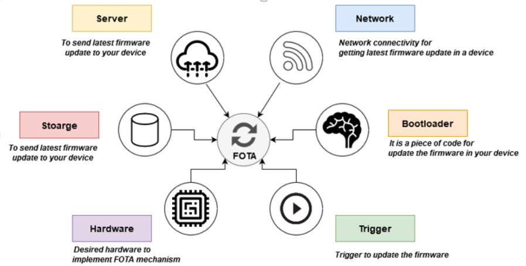

# OTA-FOTA

  <b> Firmware Over the air Mechanism  </b>

  

This Repository is the FOTA Graduation Project for Mansoura Engineering College(2020-2021):

- **Mohamed Hafez Mohamed**
- **Abdelrhman Mosad Abdelhady**
- **Osama Salah Hijazi**

## Contents
- [Problem Statement](#Problem-Statement)
- [Project Description](#project-description)
- [Project Overview](#project-overview)
  - [User GUI](#user-gui)
  - [Intermediate Gateway and Server](#intermediate-gateway-and-server)
  - [Target Hardware Firmware (Bootloader)](#target-hardware-firmware-bootloader)
- [Project Phases](#project-phases)
- [Future Enhancements](#future-enhancements)
 
## Problem Statement

* Many embedded systems are deployed in places that are difficult or impractical for a human operator to access. This is especially true for Internet of Things (IoT) applications,And with the gross of IOT fields and automotive the process of updating and keeping the software clean of bugs have been become harder and harder. 

* It is essential for companies to manage the software efficiently over the lifecycle of the device, to provide improvements in performance and to deliver corrections to faulty software that endanger lives or the environment and which could result in expensive product recalls.

## How OTA can present a solution 

OTA is the wireless delivery of new software or data to mobile devices,so we can upload the new update to the cloud and devices will be connected to the cloud so it will receive the new update through any wireless communication. 

 OTA technology will provide:
1. **Manage firmware updates across a fleet of IOT devices**
2. **Bug issues can be fixed and product behavior can be enhanced**
3. **It enables manufacturers to add new features to infrastructure**
4. **Faster time-to-market**
5. **Improved safety and compliance**

